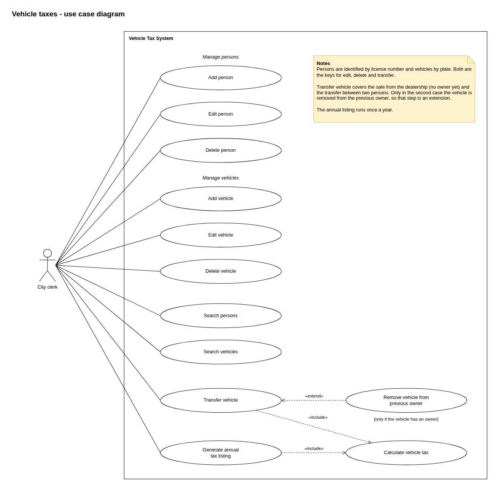
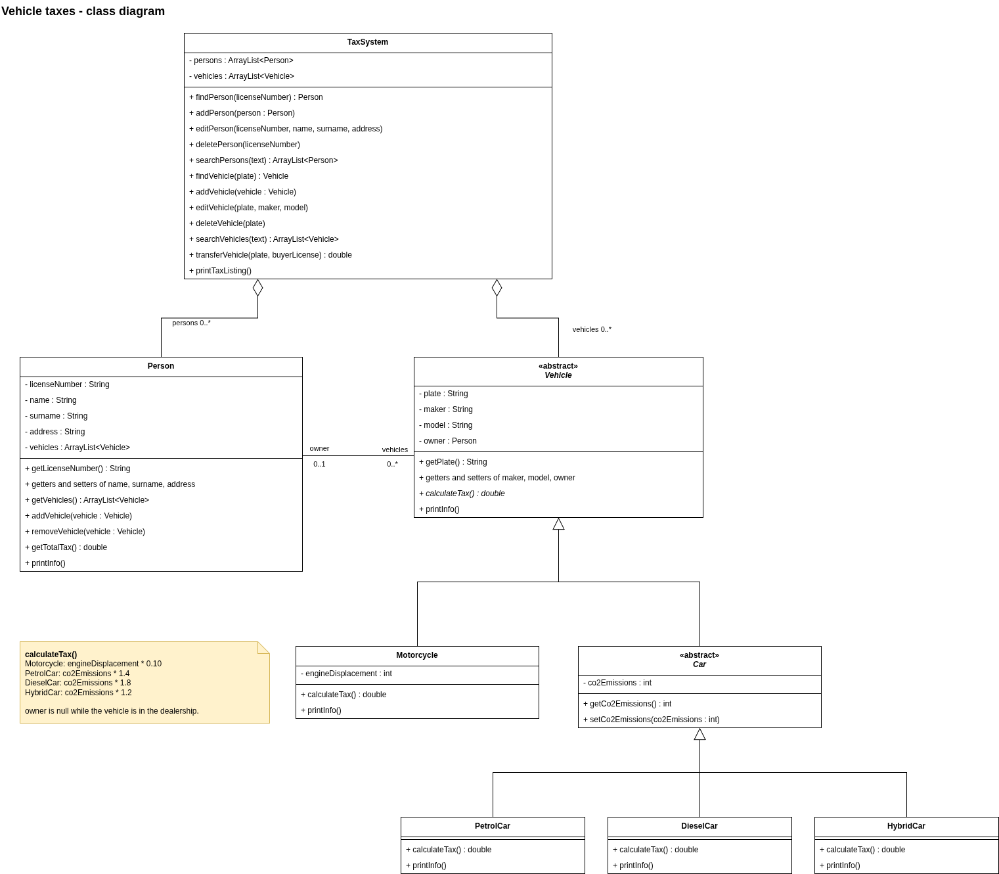
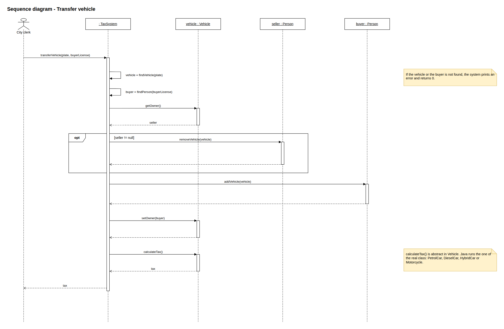
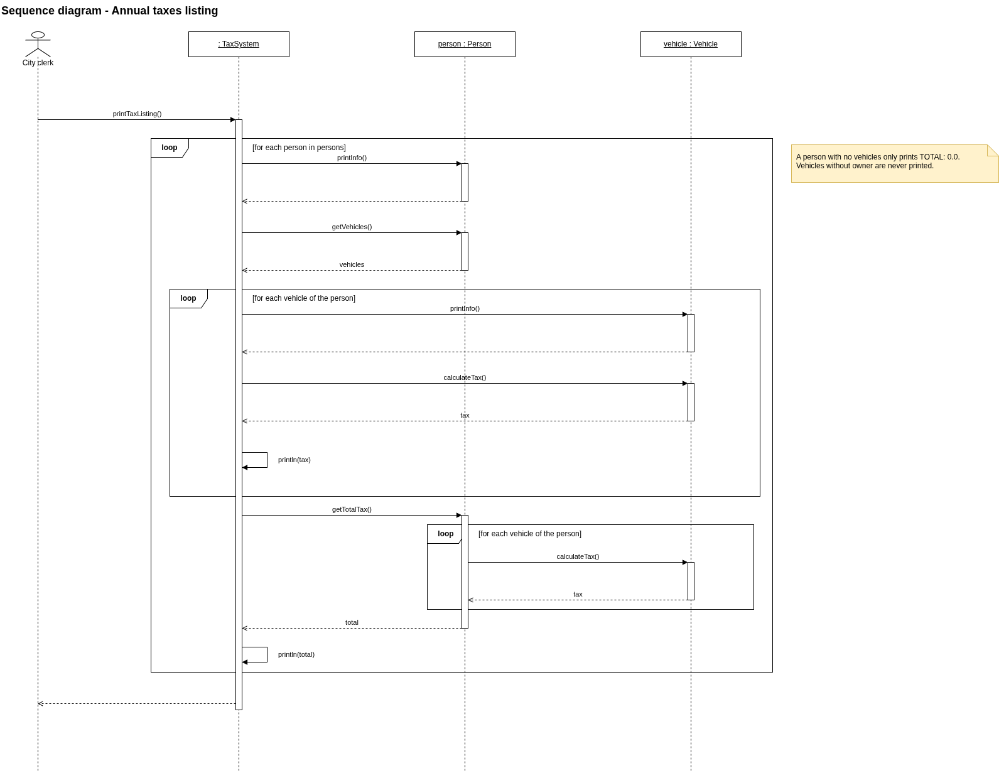

# Software Architecture - OOD Exercise 1: Vehicle taxes

System for a city to manage the taxes of vehicles (cars and motorcycles) and their owners.

## 1. Use cases

The only actor is the city clerk.

- `Calculate vehicle tax` is included by `Transfer vehicle` and `Generate annual tax listing`.
- `Remove vehicle from previous owner` extends `Transfer vehicle`. It only happens when the vehicle already had an owner.

### Use case descriptions

| Use case | Primary flow | Alternative flow |
|---|---|---|
| Add person | The clerk gives license number, name, surname and address. The system saves the person, with no vehicles. | License number already exists: error, nothing is added. |
| Edit person | The clerk gives the license number and the new name, surname and address. The system saves the changes. | Person not found: error. |
| Delete person | The clerk gives the license number. The system leaves its vehicles without owner and removes the person. | Person not found: error. |
| Add vehicle | The clerk gives plate, maker, model, type (motorcycle, petrol, diesel, hybrid) and engine displacement or CO2 emissions. The system saves the vehicle without owner (dealership). | Plate already exists: error, nothing is added. |
| Edit vehicle | The clerk gives the plate and the new maker and model. The system saves the changes. | Vehicle not found: error. |
| Delete vehicle | The clerk gives the plate. The system removes the vehicle from its owner and from the system. | Vehicle not found: error. No owner: only removed from the system. |
| Search persons | The clerk writes a text. The system returns the persons whose license, name or surname contain it. | No match: empty list. |
| Search vehicles | The clerk writes a text. The system returns the vehicles whose plate, maker or model contain it. | No match: empty list. |
| Calculate vehicle tax | Motorcycle: 10% of engine displacement. Petrol car: 1.4 €/g CO2. Diesel: 1.8 €/g. Hybrid: 1.2 €/g. | None. |

#### 1.1 Transfer vehicle

A vehicle is sold or transferred to a person. The system gives it to the buyer and returns the annual tax. Covers the sale from the dealership and the transfer between two persons.

**Primary actor:** city clerk.

**Pre-conditions:** the vehicle and the buyer are registered.

**Success guarantees:** the buyer owns the vehicle, the previous owner no longer has it, the clerk knows the annual tax.

**Primary flow:**
1. The clerk gives the plate and the license number of the buyer.
2. The system finds the vehicle and the buyer.
3. The system checks the current owner of the vehicle.
4. The system adds the vehicle to the buyer and sets the buyer as owner.
5. The system calculates the tax (*Calculate vehicle tax*) and returns it.

**Alternative flows:**
- 2a. Vehicle or buyer not found: error, returns 0, nothing changes.
- 3a. The vehicle has an owner (*Remove vehicle from previous owner*): the system removes it from the previous owner and continues at step 4.

#### 1.2 Generate annual tax listing

Once a year the system prints every owner with its vehicles, the tax of each vehicle and the owner total.

**Primary actor:** city clerk.

**Pre-conditions:** none.

**Success guarantees:** every registered person appears once with its vehicles, taxes and total.

**Primary flow:**
1. The clerk asks for the listing.
2. For each person, the system prints the person.
3. For each vehicle of the person, the system prints the vehicle and its tax (*Calculate vehicle tax*).
4. The system prints the total of the person.

**Alternative flows:**
- 3a. The person has no vehicles: no vehicle lines, total 0.
- 3b. A vehicle has no owner: it does not appear in the listing.

## 2. Class diagram

- `TaxSystem` has the lists of persons and vehicles and all the operations. Vehicles have their own list because a vehicle can exist without owner.
- `Person` has its data and its vehicles. `getTotalTax()` adds the taxes of its vehicles.
- `Vehicle` is abstract, with plate, maker, model and owner (`null` in the dealership). `calculateTax()` is abstract.
- `Motorcycle` has the engine displacement. `Car` is abstract with the CO2 emissions. `PetrolCar`, `DieselCar` and `HybridCar` implement `calculateTax()` with their price per gram.
- `Person` and `Vehicle` know each other. `TaxSystem.transferVehicle` updates both sides.

## 3. Sequence diagrams

### Transfer vehicle

The `opt` block only runs when the vehicle already had an owner.

### Annual taxes listing

## 4. Implementation in Java

All the classes are in `src/`. `Main` runs every use case.